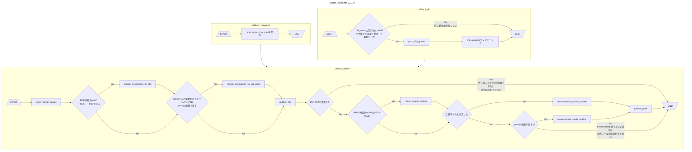

# Overview

gmps_driver nodeからsubscribeした横変位を用いて、GMPS検出通知時点での自己位置を計算する
磁気マーカーテーブルを配列として読んでいる

## Nodes
### Subscribed Topics
- prev_pose (geometry_msgs/PoseWithCovarianceStamped)  
  磁気マーカテーブルを探索する際の初期位置。EKFの前回値を想定しているが、GNSSやNDTでも構わない

- gmps_detect (gmps_msgs/GmpsDetect)  
  GMPSの検知情報。一定距離の遅延を含む。

- rfid (gmps_msgs/Rfid)  
RFIDの検知情報

### Published Topics
- gmps_pose (geometry_msgs/PoseWithCovarianceStamped)  
  Estimated pose.

### Pulished TF
- gmps_link  
  TF from "map" coordinate to estimated pose.

## Functions
### load csv
磁気マーカの座標テーブルを定義したcsvファイルの読み込み。
- mm_id 磁気マーカの通し番号
- tag_id RFIDタグの番号
- mm_kind 磁気マーカ種別
- pole 磁極
- x X座標
- y Y座標

### measurement pose
GMPSの横変位から自己位置を計算する。
- RFIDによる磁気マーカの対応付け
- EKF前回値による磁気マーカの対応付け
- 二連マーカの判定
- 二連マーカとしての位置推定
- 単体マーカとしての位置推定

## Parameter description

The parameters are set in `launch/gmps_localizer.launch.xml` .

### For pose measurement

| Name                          | Type   | Description                                                   | Default value |
| :---------------------------- | :----- | :------------------------------------------------------------ | :------------ |
| enable_pole | bool | 極性による磁気マーカテーブル探索の有効化フラグ                       | true           |
| enable_rfid | bool | RFIDによる磁気マーカテーブル探索の有効化フラグ | true |
| marker_table_csv_name| string | 磁気マーカテーブルcsvのフルパス | /path/to/marker.csv|
| tf_x | double | 座標基準点から磁気センサ中央までのオフセット[m]                       | 1.5           |
| tf_y | double | 座標基準点から磁気センサ中央までのオフセット[m] | 0.0|
| tf_yaw| double | 座標基準点から磁気センサ中央までの角度オフセット[rad] | 0.0|
|tf_rfid_x | double | 座標基準点からRFID R/Wまでのオフセット[m]| 2.0|
| sigma_x_gmps        | double | X座標の標準偏差(固定値) [m] | 0.07       |
| sigma_y_gmps        | double | Y座標の標準偏差(固定値) [m] | 0.07       |
| sigma_theta_gmps      | double | Yaw角の標準偏差(固定値) [rad] | 0.10       |

## Known issues
- 磁気マーカの個数が増えて配列marker_tableが肥大化すると処理負荷が高い
- 二連マーカのyaw判定をprev_yawの差分から計算しているが、初期位置推定直後はyawが急変するため弾かれる。操舵角を取得すべき？twistにangular.zが含まれることを前提にすべき？

# flowchart by mermaid
graphのTDは上から下、LRは左から右
